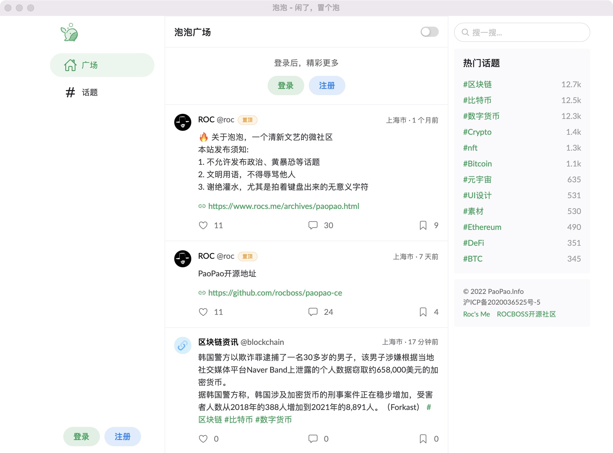

<div id="top"></div>

<!-- PROJECT SHIELDS -->
[![Go Report Card][goreport-shield]][goreport-url]
[![Forks][forks-shield]][forks-url]
[![Stargazers][stars-shield]][stars-url]
[![MIT License][license-shield]][license-url]
[![Contributors][contributors-shield]][contributors-url]
[![Issues][issues-shield]][issues-url]

<!-- PROJECT LOGO -->
<div align="center">
  <a href="https://github.com/rocboss/paopao-ce">
    
  </a>

  <h3 align="center">PaoPao</h3>

  <p align="center">
    🔥一个清新文艺的微社区
    <br />
    <a href="https://www.paopao.info/">View Demo</a>
    ·
    <a href="https://github.com/rocboss/paopao-ce/issues">Report Bug</a>
    ·
    <a href="https://www.rocs.me/archives/paopao.html">Features</a>
  </p>
</div>

---

## 预览
Web端：  
[![明色主题][product-light-screenshot]](https://www.paopao.info)

[![暗色主题][product-dark-screenshot]](https://www.paopao.info)

更多演示请前往[官网](https://www.paopao.info)体验（谢绝灌水）  

桌面端：  


<p align="right">(<a href="#top">back to top</a>)</p>

## 🛠 技术栈

PaoPao主要由以下优秀的开源项目/工具构建

* [Go](https://go.dev/)
* [Gin](https://gin-gonic.com/)
* [Zinc](https://zinclabs.io/)
* [Naive UI](https://www.naiveui.com/)
* [Vue.js](https://vuejs.org/)
* [Vite.js](https://vitejs.dev/)

<!-- GETTING STARTED -->
## 🏗 快速开始

### 环境要求

* Go (1.17+)
* Node.js (14+)
* MySQL (5.7+)
* Redis
* Zinc

\* Zinc是一款轻量级全文搜索引擎，可以查阅 <https://zincsearch.com/> 安装

以上环境版本为PaoPao官方的开发版本，仅供参考，其他版本的环境未进行充分测试

### 安装说明


### 方式一. 宝塔安装

我们为宝塔用户提供了超详细安装教程(v0.1.0版本)，仅供参考，[点此查看](https://www.rocs.me/archives/paopao_bt_install.html)

### 方式二. 手动安装

克隆代码库

   ```sh
   git clone https://github.com/rocboss/paopao-ce.git
   ```

#### 后端

1. 导入项目根目录下的 `scripts/paopao.sql` 文件至MySQL数据库
2. 拷贝项目根目录下 `config.yaml.sample` 文件至 `config.yaml`，按照注释完成配置编辑
3. 编译后端    
    编译api服务:
    ```sh
    make build
    ```
    编译api服务、内嵌web前端ui:
    ```sh
    make build TAGS='embed'
    ```
    编译后在`release`目录可以找到对应可执行文件。
    ```sh
    release/paopao-ce
    ```

4. 直接运行后端    
    运行api服务:
    ```sh
    make run
    ```
    运行api服务、web前端ui服务:
    ```sh
    make run TAGS='embed'
    ```
    提示: 如果需要内嵌web前端ui，请先构建web前端(建议设置web/.env为VITE_HOST="")。


#### 前端

1. 进入前端目录 `web`，编辑 `.env` 文件中后端服务地址，下载依赖包

    ```sh
    cd ./web
    vim .env
    yarn
    ```

2. 编译前端

    ```sh
    yarn build
    ```

    build完成后，可以在dist目录获取编译产出，配置nginx指向至该目录即可

#### 桌面端

1. 进入前端目录 `web`，编辑 `.env` 文件中后端服务地址，下载依赖包

    ```sh
    cd ./web
    vim .env
    yarn
    ```

2. 编译前端

    ```sh
    yarn build
    ```
   
3. 构建桌面端
   ```sh
   yarn tauri build
   ```
   桌面端是使用[Rust](https://www.rust-lang.org/) + [tauri](https://github.com/tauri-apps/tauri)编写
   的，需要安装tauri的依赖，具体参考[https://tauri.studio/v1/guides/getting-started/prerequisites](https://tauri.studio/v1/guides/getting-started/prerequisites).


### 方式三. 使用Docker构建、运行
  * 后端:
  ```sh
  # 默认参数构建, 默认内嵌web ui并设置api host为空
  docker build -t your/paopao-ce:tag .

  # 内嵌web ui并且自定义API host参数
  docker build -t your/paopao-ce:tag --build-arg API_HOST=http://paopao.info .

  # 内嵌web ui并且使用本地web/.env中的API host
  docker build -t your/paopao-ce:tag --build-arg USE_API_HOST=no .

  # 内嵌web ui并且使用本地编译的web/dist构建
  docker build -t your/paopao-ce:tag --build-arg USE_DIST=yes .

  # 只编译api server
  docker build -t your/paopao-ce:tag --build-arg EMBED_UI=no .

  # 运行
  docker run -p 8008:8008 -v ${PWD}/config.yaml.sample:/app/paopao-ce/config.yaml your/paopao-ce:tag
  ```

  * 前端:
  ```sh
  cd web

  # 默认参数构建
  docker build -t your/paopao-ce:web .

  # 自定义API host 参数构建
  docker build -t your/paopao-ce:web --build-arg API_HOST=http://paopao.info .

  # 使用本地编译的dist构建
  docker build -t your/paopao-ce:web --build-arg USE_DIST=yes .
  ```

### 方式四. 使用 docker-compose 运行
```sh
git clone https://github.com/rocboss/paopao-ce.git
docker compose up --build
# visit paopao-ce(http://127.0.0.1:8008) and phpMysqlAdmin(http://127.0.0.1:8080)
```

默认是使用config.yaml.sample的配置，如果需要自定义配置，请拷贝默认配置文件(比如config.yaml)，修改后再同步配置到docker-compose.yaml如下：

```
# file: docker-compose.yaml
...
  backend:
    build:
      context: .
    restart: always
    depends_on:
      - db
      - redis
      - zinc
    # modify below to reflect your custom configure
    volumes:
      - ./config.yaml:/app/paopao-ce/config.yaml
    ports:
      - 8008:8008
    networks:
      - paopao-network
....
```

> 注意：默认提供的 docker-compose.yaml 仅用于搭建本机开发调试环境，paopao-ce/phpMysqlAdmin 默认只能本机访问，如果需要产品部署供外网访问，请自行修改配置参数或使用其他方式部署。

### API 文档
构建时将 `docs` 添加到TAGS中:
```sh
make run TAGS='docs'

# visit http://127.0.0.1:8008/docs
```

### 配置说明

`config.yaml.sample` 是一份完整的配置文件模版，paopao-ce启动时会读取`./configs/config.yaml`、`./config.yaml`任意一份配置文件（优先读取最先找到的文件）。

```sh
cp config.yaml.sample config.yaml
vim config.yaml # 修改参数
paopao-ce
```

配置文件中的 `Features` 小节是声明paopao-ce运行时开启哪些功能项:

```yaml
...

Features:
  Default: ["Base", "MySQL", "Option", "LocalOSS", "LoggerFile"]
  Develop: ["Base", "MySQL", "Option", "Sms", "AliOSS", "LoggerZinc"]
  Demo: ["Base", "MySQL", "Option", "Sms", "MinIO", "LoggerZinc"]
  Slim: ["Base", "Sqlite3", "LocalOSS", "LoggerFile"]
  Base: ["Zinc", "Redis", "Alipay",]
  Option: ["SimpleCacheIndex"]
  Sms: "SmsJuhe"

...
```

如上： 
Default/Develop/Demo/Slim 是不同 功能集套件(Features Suite)， Base/Option 是子功能套件， Sms是关于短信验证码功能的参数选项。

这里 `Default`套件 代表的意思是： 使用`Base/Option` 中的功能，外加 `MySQL/LocalOSS/LoggerFile`功能，也就是说开启了`Zinc/Redis/Alipay/SimpleCacheIndex/MySQL/LocalOSS/LoggerFile` 7项功能； 
`Develop`套件依例类推。 

使用Feautures:

```sh
release/paopao-ce --help
Usage of release/paopao-ce:
  -features value
        use special features
  -no-default-features
        whether use default features

# 默认使用 Default 功能套件
release/paopao-ce 

# 不包含 default 中的功能集，仅仅使用 develop 中声明的功能集
release/paopao-ce --no-default-features --features develop 

# 使用 default 中的功能集，外加 sms 功能
release/paopao-ce --features sms  

# 手动指定需要开启的功能集
release/paopao-ce --no-default-features --features sqlite3,localoss,loggerfile,redis 
```

目前支持的功能集合:
* 数据库: MySQL/Sqlite3/PostgreSQL   
* 对象存储: AliOSS/MinIO/LocalOSS    
  `LocalOSS` 提供使用本地目录文件作为对象存储的功能，仅用于开发调试环境；  
* 缓存: Redis/SimpleCacheIndex/BigCacheIndex     
  `SimpleCacheIndex`提供简单的 广场推文列表 的缓存功能；   
  `BigCacheIndex` 使用[BigCache](https://github.com/allegro/bigcache)缓存 广场推文列表，缓存每个用户每一页，简单做到千人千面；  
* 搜索: Zinc  
* 日志: LoggerFile/LoggerZinc  
  `LoggerFile` 使用文件写日志；  
  `LoggerZinc` 使用Zinc写日志;  
* 支付: Alipay  
* 短信验证码: SmsJuhe(需要开启sms)  
  `Sms`功能如果没有开启，任意短信验证码都可以绑定手机；  

### 其他说明

建议后端服务使用 `supervisor` 守护进程，并通过 `nginx` 反向代理后，提供API给前端服务调用。

短信通道使用的[聚合数据](https://www.juhe.cn/)，如果申请不下来，可以考虑替换其他服务商。

代码结构比较简单，很方便扩展

## 👯‍♀️ 贡献

喜欢的朋友欢迎给个Star、贡献PR。

## License

Distributed under the MIT License. See `LICENSE` for more information.

<!-- MARKDOWN LINKS & IMAGES -->
[contributors-shield]: https://img.shields.io/github/contributors/rocboss/paopao-ce?style=flat
[contributors-url]: https://github.com/rocboss/paopao-ce/graphs/contributors
[goreport-shield]: https://goreportcard.com/badge/github.com/rocboss/paopao-ce
[goreport-url]: https://goreportcard.com/report/github.com/rocboss/paopao-ce
[forks-shield]: https://img.shields.io/github/forks/rocboss/paopao-ce?style=flat
[forks-url]: https://github.com/rocboss/paopao-ce/network/members
[stars-shield]: https://img.shields.io/github/stars/rocboss/paopao-ce.svg?style=flat
[stars-url]: https://github.com/rocboss/paopao-ce/stargazers
[issues-shield]: https://img.shields.io/github/issues/rocboss/paopao-ce.svg?style=flat
[issues-url]: https://github.com/rocboss/paopao-ce/issues
[license-shield]: https://img.shields.io/github/license/rocboss/paopao-ce.svg?style=flat
[license-url]: https://github.com/rocboss/paopao-ce/blob/master/LICENSE.txt
[linkedin-shield]: https://img.shields.io/badge/-LinkedIn-black.svg?style=flat&logo=linkedin&colorB=555
[product-light-screenshot]: https://cdn.rocs.me/static/paopao-light.jpeg
[product-dark-screenshot]: https://cdn.rocs.me/static/paopao-dark.jpeg
